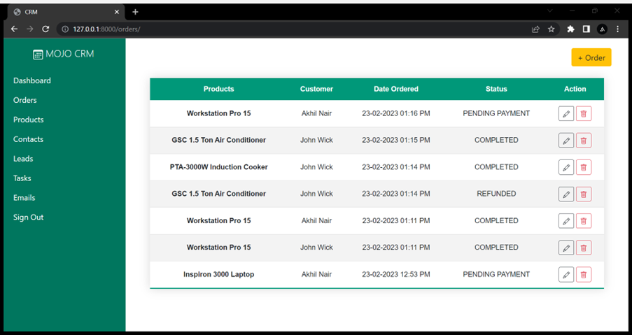
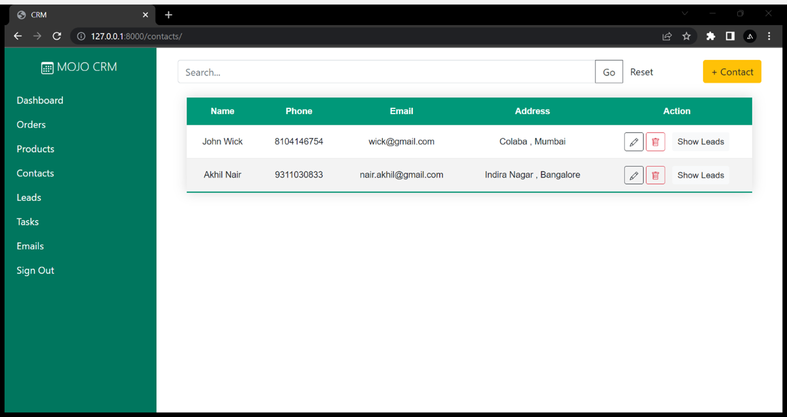
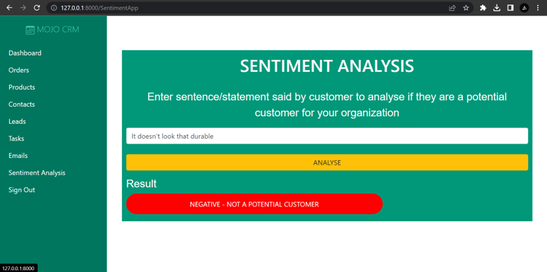

# MOJO CRM - An AI based CRM system
This is a AI enhanced Customer Relationship System Project made by me for my Semester 6 Blackbook project . The main motive behind developing this CRM system is that traditional CRMs existing today have most of the required features but almost every single system is dependant on Manual  work and in this progressing world of AI and automation , I intend to create a complete CRM with everything from basic to additional automated features which will help businesses as well as their customers to increase their efficiency and ensure smoother work flow.

The main features of this CRM system include :

1. Log In :
In order to use the CRM system and its features , the user must login and enter his/her registered information correctly.

2. Admin control :
The admin can add other users and decide the roles and rights of different users ie managing the accessibility rights for the system.

3. Main Dashboard :
The user/admin can see and navigate to the different sections of the CRM system like Tasks , Leads , Emails , Organizations and Contacts.

4. Contacts , Products :
The user/admin can add, edit and manage the organization’s contacts and their products which helps in customer interaction and sales .

5. Emails section with Automatic Spam filtering :
The user/admin can send and receive emails of their organization in this section where automatic AI spam filtering will be done , so only relevant
and useful data will be stored and presented .

6. Tasks :
This section contains the different tasks assigned to the user/admin to perform on the following day . These tasks can be added or edited by the user themselves or the admin will assign specifically to them . Tasks examples include calling or emailing a person , following up with a lead etc.

7. Leads section using Sentiment Analysis :
The user can input the main statements from the call they had with a customer and the system will predict on the basis of the statement if he/she can be a potential or recurring customer for the organization.

8. AI Chatbot :
The user has the accessibility to communicate and ask queries to an inbuilt AI Chatbot which can answer basic questions related to the features and sections of the CRM system and help them navigate to their required pages.

### Screenshots

<table>
  <tr>
  <td align="center">
      
       
      
Login Page

    </td>
    <td align="center">
      
       
      
Dashboard

    </td>
    <td align="center">
      
       
      
Contacts

    </td>
    <td align="center">
      
       
      
Products

    </td>
    <td align="center">
      
       
      
Tasks

    </td>
    </tr>
</table>

